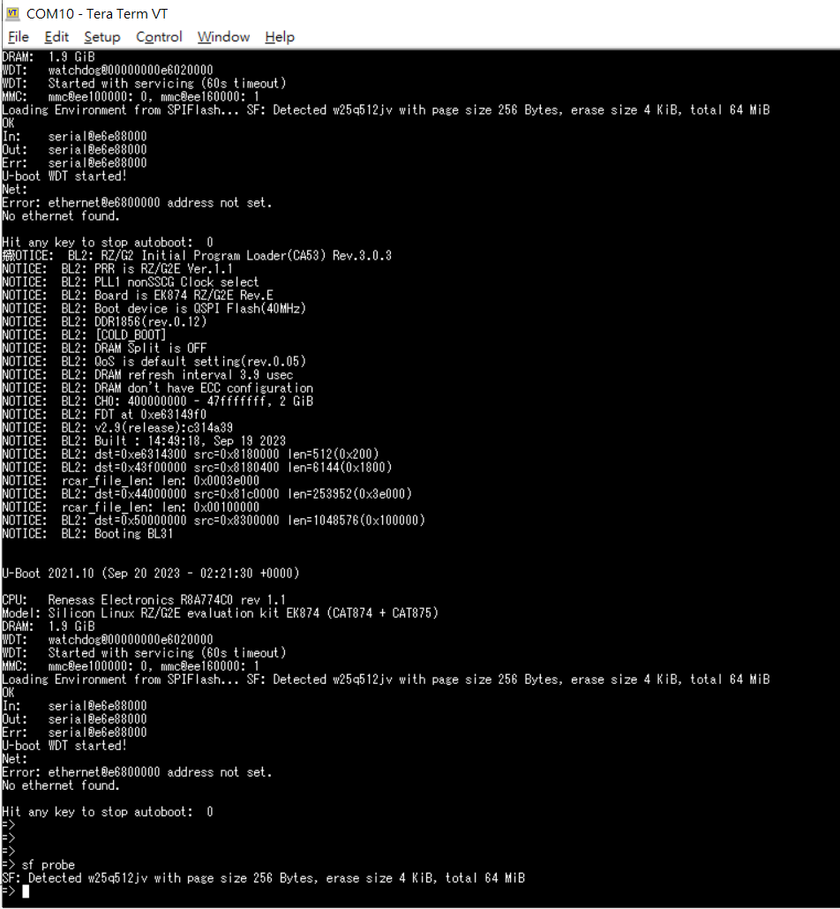
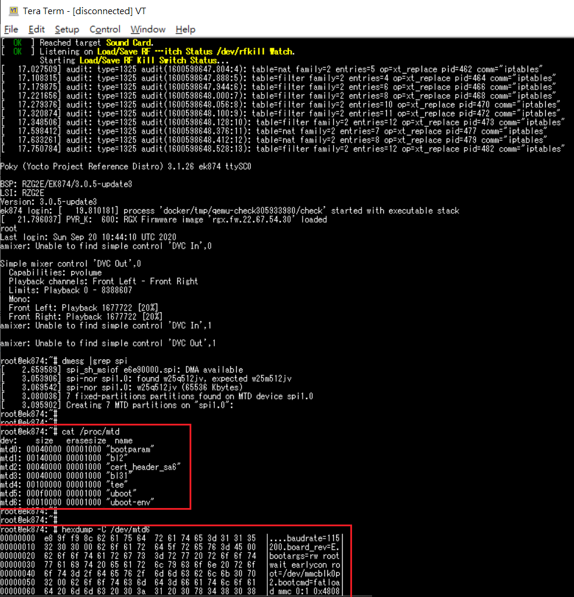

# Renesas RZ/G2E for Quanta Purpose Record
* Target: QSPI flash appear in Linux yocto

* SPI Driver: drivers/mtd/spi-nor/winbond.c

* Base on **RZ/G Verified Linux Package v3.0.5-update3**

* Linux kernel path: https://github.com/renesas-rz/rz_linux-cip/tree/rz-5.10-cip36  
	Branch: rz-5.10-cip36  
	Checkout: [c45e3a8129dd0ee36c51079e95962b2f85472e51](https://github.com/renesas-rz/rz_linux-cip/tree/c45e3a8129dd0ee36c51079e95962b2f85472e51)
* Test EVK: **RZ/G2E EK874(Rev.E)**

## Modify Decription:

###### 1. Get qspi information from bootloader
```
uboot
=> sf probe
SF: Detected w25q512jv with page size 256 Bytes, erase size 4 KiB, total 64 MiB
```


###### 2. Device Tree: Setting /soc/spi
* r8a774c0.dtsi
```
diff --git a/arch/arm64/boot/dts/renesas/r8a774c0.dtsi b/arch/arm64/boot/dts/renesas/r8a774c0.dtsi
index 2a296840865b..c9046b97e360 100644
--- a/arch/arm64/boot/dts/renesas/r8a774c0.dtsi
+++ b/arch/arm64/boot/dts/renesas/r8a774c0.dtsi
@@ -1695,6 +1695,23 @@ sdhi3: mmc@ee160000 {
 			status = "disabled";
 		};
 
+		rpc: spi@ee200000 {
+				compatible = "renesas,r8a774c0-rpc-if",
+							"renesas,rcar-gen3-rpc-if";
+				reg = <0 0xee200000 0 0x200>,
+					<0 0x08000000 0 0x4000000>,
+					<0 0xee208000 0 0x100>;
+				reg-names = "regs", "dirmap", "wbuf";
+				interrupts = <GIC_SPI 38 IRQ_TYPE_LEVEL_HIGH>;
+				clocks = <&cpg CPG_MOD 917>;
+				clock-names = "rpc";
+				power-domains = <&sysc R8A774C0_PD_ALWAYS_ON>;
+				resets = <&cpg 917>;
+				#address-cells = <1>;
+				#size-cells = <0>;
+				status = "disabled";
+		};
+
 		gic: interrupt-controller@f1010000 {
 			compatible = "arm,gic-400";
 			#interrupt-cells = <3>;
```


###### 3. Device Tree: Set compatible and partition
* r8a774c0-cat874.dts
```
diff --git a/arch/arm64/boot/dts/renesas/r8a774c0-cat874.dts b/arch/arm64/boot/dts/renesas/r8a774c0-cat874.dts
index 29089c1f4c2a..936dfb6037a4 100644
--- a/arch/arm64/boot/dts/renesas/r8a774c0-cat874.dts
+++ b/arch/arm64/boot/dts/renesas/r8a774c0-cat874.dts
@@ -102,6 +102,64 @@ sound_pins: sound {
 		groups = "ssi01239_ctrl", "ssi0_data";
 		function = "ssi";
 	};
+
+	qspi0_pins: qspi0 {
+		groups = "qspi0_ctrl", "qspi0_data4";
+		function = "qspi0";
+	};
+};
+
+&rpc {
+		pinctrl-0 = <&qspi0_pins>;
+		pinctrl-names = "default";
+		status = "okay";
+		flash@0 {
+				compatible = "winbond,w25m512jv", "jedec,spi-nor";
+				reg = <0>;
+				spi-max-frequency = <50000000>;
+				spi-rx-bus-width = <4>;
+
+		partitions {
+			compatible = "fixed-partitions";
+			#address-cells = <1>;
+			#size-cells = <1>;
+
+			bootparam@0 {
+				reg = <0x00000000 0x040000>;
+				read-only;
+			};
+
+			bl2@40000 {
+				reg = <0x00040000 0x140000>;
+				read-only;
+			};
+
+			cert_header_sa6@180000 {
+				reg = <0x00180000 0x040000>;
+				read-only;
+			};
+
+			bl31@1c0000 {
+				reg = <0x001c0000 0x040000>;
+				read-only;
+			};
+
+			tee@200000 {
+				reg = <0x00200000 0x100000>;
+				read-only;
+			};
+
+			uboot@300000 {
+				reg = <0x00300000 0x0f0000>;
+				read-only;
+			};
+
+			uboot-env@3f0000 {
+				reg = <0x003f0000 0x010000>;
+				read-only;
+			};
+		};
+	};
 };
 
 &hscif2 {
```


##### 4. Add w25q512jv to flash_info in drivers/mtd/spi-nor/winbond.c
```
diff --git a/drivers/mtd/spi-nor/winbond.c b/drivers/mtd/spi-nor/winbond.c
index e5dfa786f190..49caf282704b 100644
--- a/drivers/mtd/spi-nor/winbond.c
+++ b/drivers/mtd/spi-nor/winbond.c
@@ -97,6 +97,9 @@ static const struct flash_info winbond_parts[] = {
 			     SECT_4K | SPI_NOR_DUAL_READ | SPI_NOR_QUAD_READ) },
 	{ "w25m512jv", INFO(0xef7119, 0, 64 * 1024, 1024,
 			    SECT_4K | SPI_NOR_QUAD_READ | SPI_NOR_DUAL_READ) },
+	{ "w25q512jv", INFO(0xef4020, 0, 64 * 1024, 1024,
+			    SECT_4K | SPI_NOR_DUAL_READ | SPI_NOR_QUAD_READ |
+			    SPI_NOR_HAS_LOCK | SPI_NOR_HAS_TB) },
 };
 
 /**
```

## How to use patch:
```
$ cd {RZG2E_workspace}/{kernel path}  
ex: cd RZG2E/build/tmp/work-shared/smarc-rzg2ul/kernel-source/
$ git apply --check rzg2e_spi_flash_in_linux.patch
$ git apply rzg2e_spi_flash_in_linux.patch
```

## Build
```
$ MACHINE=ek874 bitbake linux-renesas -fc compile
$ MACHINE=ek874 bitbake linux-renesas -fc deploy
$ MACHINE=ek874 bitbake core-image-weston
```

## What I Learning?
##### 1. Check QSPI Information
* uboot command `sf probe`
```
=> sf probe
SF: Detected w25q512jv with page size 256 Bytes, erase size 4 KiB, total 64 MiB
```

##### 2. dts need to match driver setting
* r8a774c0-cat874.dts
```
compatible = "winbond,w25m512jv", "jedec,spi-nor";  
```
* winbond.c
```
{ "w25q512jv", INFO(0xef4020, 0, 64 * 1024, 1024,
			    SECT_4K | SPI_NOR_DUAL_READ | SPI_NOR_QUAD_READ |
			    SPI_NOR_HAS_LOCK | SPI_NOR_HAS_TB) },  
```

##### 3. SPI partition set in Device Tree
* r8a774c0-cat874.dts
```
&rpc {
		pinctrl-0 = <&qspi0_pins>;
		pinctrl-names = "default";
		status = "okay";
		flash@0 {
				compatible = "winbond,w25m512jv", "jedec,spi-nor";
				reg = <0>;
				spi-max-frequency = <50000000>;
				spi-rx-bus-width = <4>;

		partitions {
			compatible = "fixed-partitions";
			#address-cells = <1>;
			#size-cells = <1>;

			bootparam@0 {
				reg = <0x00000000 0x040000>;
				read-only;
			};

			bl2@40000 {
				reg = <0x00040000 0x140000>;
				read-only;
			};

			cert_header_sa6@180000 {
				reg = <0x00180000 0x040000>;
				read-only;
			};

			bl31@1c0000 {
				reg = <0x001c0000 0x040000>;
				read-only;
			};

			tee@200000 {
				reg = <0x00200000 0x100000>;
				read-only;
			};

			uboot@300000 {
				reg = <0x00300000 0x0f0000>;
				read-only;
			};

			uboot-env@3f0000 {
				reg = <0x003f0000 0x010000>;
				read-only;
			};
		};
	};
};
```

4. `$ dmesg` get spi information. Check mtd `$cat /proc/mtd` (finish get)
```
root@ek874:~# dmesg | grep spi
[    2.553163] spi_sh_msiof e6e90000.spi: DMA available
[    2.919136] spi-nor spi0.0: found w25q512jv, expected w25m512jv
[    2.934495] spi-nor spi0.0: w25q512jv (65536 Kbytes)
[    2.942773] 7 fixed-partitions partitions found on MTD device spi0.0
[    2.949475] Creating 7 MTD partitions on "spi0.0":
root@ek874:~#
root@ek874:~# cat /proc/mtd
dev:    size   erasesize  name
mtd0: 00040000 00001000 "bootparam"
mtd1: 00140000 00001000 "bl2"
mtd2: 00040000 00001000 "cert_header_sa6"
mtd3: 00040000 00001000 "bl31"
mtd4: 00100000 00001000 "tee"
mtd5: 000f0000 00001000 "uboot"
mtd6: 00010000 00001000 "uboot-env"
root@ek874:~#
```

5. How to dump QSPI partition
```
root@ek874:~# hexdump -C /dev/mtd6  //mtd0~6
00000000  e8 9f f9 8c 62 61 75 64  72 61 74 65 3d 31 31 35  |....baudrate=115|
00000010  32 30 30 00 62 6f 61 72  64 5f 72 65 76 3d 45 00  |200.board_rev=E.|
00000020  62 6f 6f 74 61 72 67 73  3d 72 77 20 72 6f 6f 74  |bootargs=rw root|
00000030  77 61 69 74 20 65 61 72  6c 79 63 6f 6e 20 72 6f  |wait earlycon ro|
00000040  6f 74 3d 2f 64 65 76 2f  6d 6d 63 62 6c 6b 30 70  |ot=/dev/mmcblk0p|
00000050  32 00 62 6f 6f 74 63 6d  64 3d 66 61 74 6c 6f 61  |2.bootcmd=fatloa|
00000060  64 20 6d 6d 63 20 30 3a  31 20 30 78 34 38 30 38  |d mmc 0:1 0x4808|
00000070  30 30 30 30 20 49 6d 61  67 65 2d 65 6b 38 37 34  |0000 Image-ek874|
............
............
```


## Reference Renesas Info:  

https://renesas.info/wiki/RZ-G/RZG_DeviceTree#QSPI_Flash

>#### QSPI Flash
>Linux Drivers  
>RZ/G2H, G2M, G2N, G2E:  
>>drivers/spi/spi-rpc-if.c  
>>drivers/memory/renesas-rpc-if.c  
>>drivers/mtd/hyperbus/rpc-if.c  
>>CONFIG_SPI_RPCIF=y  
>>CONFIG_RENESAS_RPCIF=y  
>>CONFIG_RPCIF_HYPERBUS=y <mark>G2E no need to set</mark>  
>RZ/G2L, G2LC, G2UL, V2L:  
>>CONFIG_xxx=y

>#### Notes  
>unrecognized JEDEC id bytes: If when booting the kernel, you get a message like:
```
[    2.328844] rpc-if-spi rpc-if-spi: registered master spi2
[    2.328891] spi spi2.0: setup mode 0, 8 bits/w, 50000000 Hz max --> 0
[    2.329230] spi-nor spi2.0: unrecognized JEDEC id bytes: 1f 87 01 1f 87 01
```
<mark>JEDEC id same as struct flash_info INFO(0x1f8701, ...</mark>
>it means this nor flash is not supported in the Linux kernel. To support this flash, you should add this flash info in "static const struct flash_info atmel_parts[]" in drivers/mtd/spi-nor/atmel.c:  
<mark>atmel if for RZ/G2UL EVK QSPI AT25QL128A use. RZG2E is use w25q512jv.</mark>

```
{ "at25sf321", INFO(0x1f8701, 0, 64 * 1024, 64, SECT_4K | SPI_NOR_DUAL_READ | SPI_NOR_QUAD_READ) },
```

## Other Reference:
https://community.renesas.com/rz/f/rz-forum/31039/rz-g2ul-qspi-flash-bring-up-in-kernel

https://lore.kernel.org/linux-mtd/161518259586.63466.11466749485988604375.b4-ty@microchip.com/T/
